  ## framewotk PHP code igneter

  ## Nama   : Fajar Firmansyah
  ## NIM    : 312010309
  ## Kelas  : TI.20.A.2

  # TUGAS CODE IGNITER

  Instruksi Praktikum

Persiapkan text editor misalnya VSCode.

Buat folder baru dengan nama lab11_php_ci pada docroot webserver (htdocs)

Ikuti langkah-langkah praktikum yang akan dijelaskan berikutnya.

Langkah-langkah Praktikum

Persiapan

Sebelum memulai menggunakan Framework Codeigniter, perlu dilakukan konfigurasi pada webserver. Beberapa ekstensi PHP perlu diaktifkan untuk kebutuhan pengembangan Codeigniter 4.

Berikut beberapa ekstensi yang perlu diaktifkan:

• php-json ekstension untuk bekerja dengan JSON;

• php-mysqlnd native driver untuk MySQL;

• php-xml ekstension untuk bekerja dengan XML;

• php-intl ekstensi untuk membuat aplikasi multibahasa;

• libcurl (opsional), jika ingin pakai Curl.

Untuk mengaktifkan ekstentsi tersebut, melalu XAMPP Control Panel, pada bagian Apache klik Config -> PHP.in

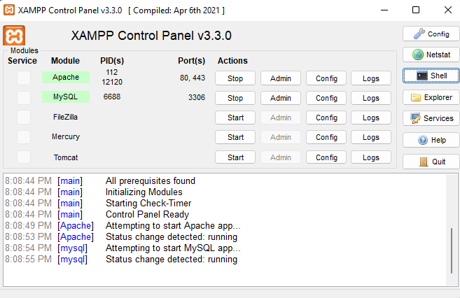

Instalasi Codeigniter 4 Untuk melakukan instalasi Codeigniter 4 dapat dilakukan dengan dua cara, yaitu cara manual dan menggunakan composer. Pada praktikum ini kita menggunakan cara manual.

• Unduh Codeigniter dari website https://codeigniter.com/download

• Extrak file zip Codeigniter ke direktori htdocs/lab11_ci.

• Ubah nama direktory framework-4.x.xx menjadi ci4.

• Buka browser dengan alamat http://localhost/lab11_ci/ci4/public

### Mengatur URL

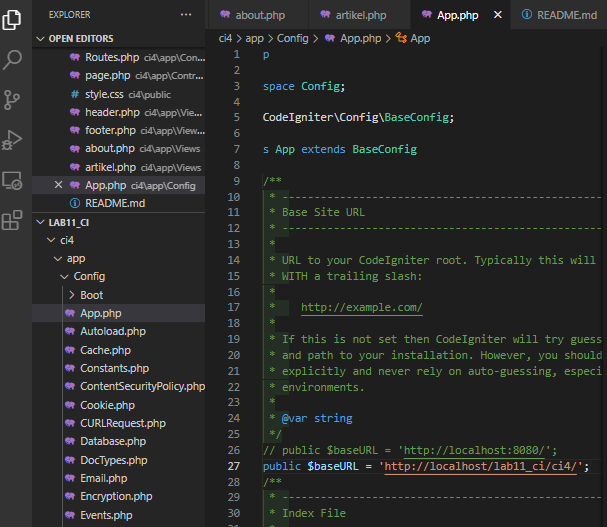

### Setting Exstension

### Menjalankan CLI (Command Line Interface)

Codeigniter 4 menyediakan CLI untuk mempermudah proses development. Untuk mengakses CLI buka terminal/command prompt.

Arahkan lokasi direktori sesuai dengan direktori kerja project dibuat (xampp/htdocs/lab11_ci/ci4/) Perintah yang dapat dijalankan untuk memanggil CLI Codeigniter adalah:

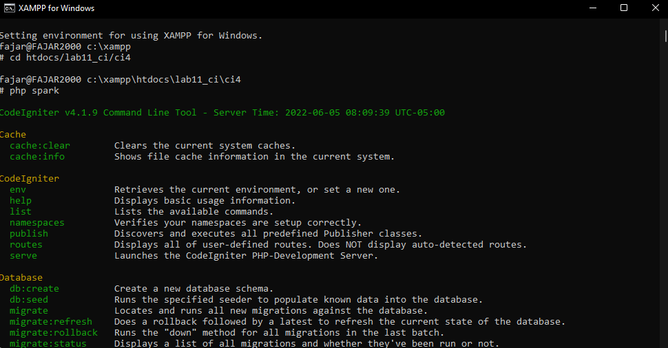

### Mengaktifkan Mode Debugging

Codeigniter 4 menyediakan fitur debugging untuk memudahkan developer untuk mengetahui pesan error apabila terjadi kesalahan dalam membuat kode program. Secara default fitur ini belum aktif. Ketika terjadi error pada aplikasi akan ditampilkan pesan kesalahan seperti berikut

Semua jenis error akan ditampilkan sama. Untuk memudahkan mengetahui jenis errornya, maka perlu diaktifkan mode debugging dengan mengubah nilai konfigurasi pada environment variable CI_ENVIRINMENT menjadi development.

Ubah nama file env menjadi .env kemudian buka file tersebut dan ubah nilai variable CI_ENVIRINMENT menjadi development

Contoh error yang terjadi. Untuk mencoba error tersebut, ubah kode pada file app/Controller/Home.php hilangkan titik koma pada akhir kode

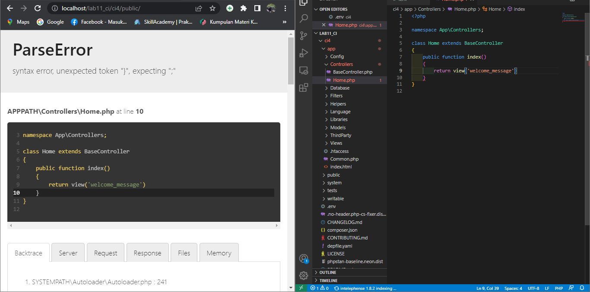

Struktur Direktori

Untuk lebih memahami Framework Codeigniter 4 perlu mengetahui struktur direktori dan file yang ada. Buka pada Windows Explorer atau dari Visual Studio Code -> Open Folder.

Terdapat beberapa direktori dan file yang perlu dipahami fungsi dan kegunaannya.

• .github folder ini kita butuhkan untuk konfigurasi repo github, seperti konfigurasi untuk build dengan github action;

• app folder ini akan berisi kode dari aplikasi yang kita kembangkan;

• public folder ini berisi file yang bisa diakses oleh publik, seperti file index.php, robots.txt, favicon.ico, ads.txt, dll;

• tests folder ini berisi kode untuk melakukan testing dengna PHPunit vendor folder ini berisi library yang dibutuhkan oleh aplikasi, isinya juga termasuk kode core dari system CI.

• writable folder ini berisi file yang ditulis oleh aplikasi. Nantinya, kita bisa pakai untuk menyimpan file yang di-upload, logs, session, dll.

Sedangkan file-file yang berada pada root direktori CI sebagai berikut.

• .env adalah file yang berisi variabel environment yang dibutuhkan oleh aplikasi.

• .gitignore adalah file yang berisi daftar nama file dan folder yang akan diabaikan oleh Git.

• build adalah script untuk mengubah versi codeigniter yang digunakan. Ada versi release (stabil) dan development (labil).

• composer.json adalah file JSON yang berisi informasi tentang proyek dan daftar library yang dibutuhkannya. File ini digunakan oleh Composer sebagai acuan.

• composer.lock adalah file yang berisi informasi versi dari libraray yang digunakan aplikasi.

• license.txt adalah file yang berisi penjelasan tentang lisensi Codeigniter;

• phpunit.xml.dist adalah file XML yang berisi konfigurasi untuk PHPunit.

• README.md adalah file keterangan tentang codebase CI. Ini biasanya akan dibutuhkan pada repo github atau gitlab.

• spark adalah program atau script yang berfungsi untuk menjalankan server, generate kode, dll.

### Spark

Fokus kita pada folder app, dimana folder tersebut adalah area kerja kita untuk membuat aplikasi. Dan folder public untuk menyimpan aset web seperti css, gambar, javascript, dll.

Memahami Konsep MVC Codeigniter menggunakan konsep MVC. MVC meripakan singkatan dari Model-View-Controller. MVC merupakan konsep arsitektur yang umum digunakan dalam pengembangan aplikasi. Konsep MVC adalah memisahkan kode program berdasarkan logic proses, data, dan tampilan. Untuk logic proses diletakkan pada direktori Contoller, Objek data diletakkan pada direktori Model, dan desain tampilan diletakkan pada direktori View.

Codeigniter menggunakan konsep pemrograman berorientasi objek dalam mengimplementasikan konsep MVC.

Model merupakan kode program yang berisi pemodelan data. Data dapat berupa database ataupun sumber lainnya.

View merupakan kode program yang berisi bagian yang menangani terkait tampilan user interface sebuah aplikasi. didalam aplikasi web biasanya pasti akan berhubungan dengan html dan css.

Controller merupakaan kode program yang berkaitan dengan logic proses yang menghubungkan antara view dan model. Controller berfungsi untuk menerima request dan data dari user kemudian diproses dengan menghubungkan bagian model dan view. Routing dan Controller

Routing merupakan proses yang mengatur arah atau rute dari request untuk menentukan fungsi/bagian mana yang akan memproses request tersebut. Pada framework CI4, routing bertujuan untuk menentukan Controller mana yang harus merespon sebuah request. Controller adalah class atau script yang bertanggung jawab merespon sebuah request.

Pada Codeigniter, request yang diterima oleh file index.php akan diarahkan ke Router untuk meudian oleh router tesebut diarahkan ke Controller. Router terletak pada file app/config/Routes.php

Untuk mengetahui route yang ditambahkan sudah benar, buka CLI dan jalankan perintah berikut.

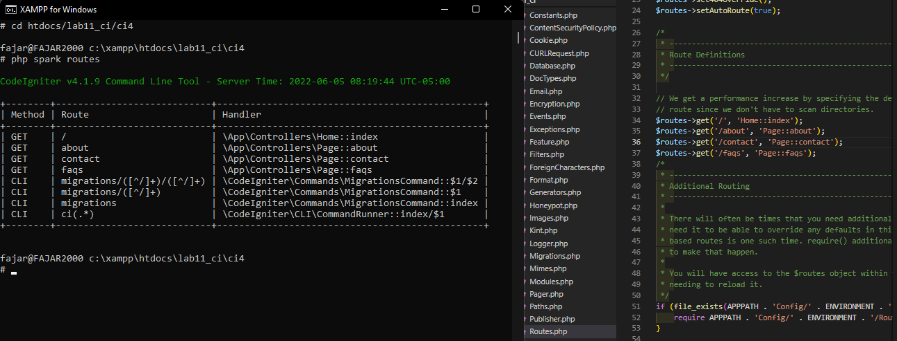

Selanjutnya coba akses route yang telah dibuat dengan mengakses alamat url http://localhost:8080/about

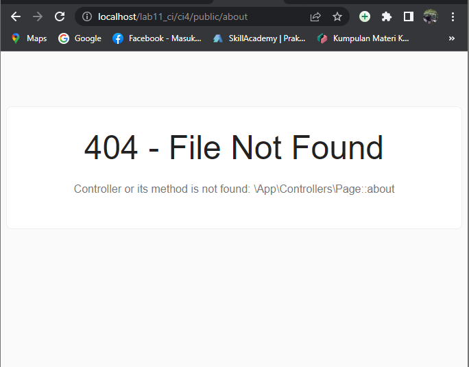

Ketika diakses akan mucul tampilan error 404 file not found, itu artinya file/page tersebut tidak ada. Untuk dapat mengakses halaman tersebut, harus dibuat terlebih dahulu Contoller yang sesuai dengan routing yang dibuat yaitu Contoller Page. Membuat Controller

Selanjutnya adalah membuat Controller Page. Buat file baru dengan nama page.php pada direktori Controller kemudian isi kodenya seperti berikut.

Selanjutnya refresh Kembali browser, maka akan ditampilkan hasilnya yaotu halaman sudah dapat diakses.

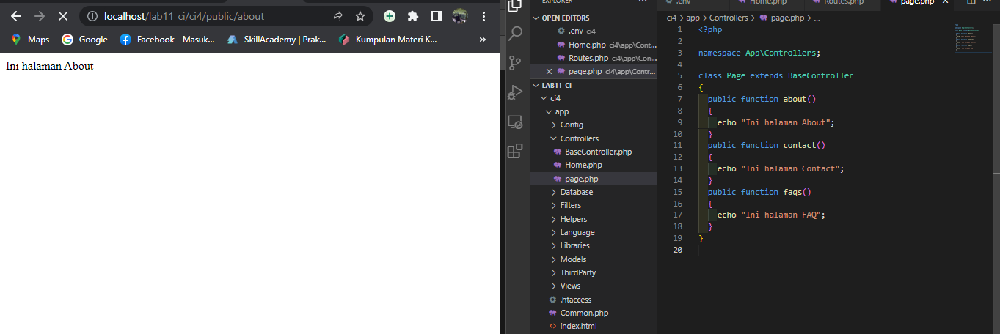

Auto Routing Secara default fitur autoroute pada Codeiginiter sudah aktif. Untuk mengubah status autoroute dapat mengubah nilai variabelnya. Untuk menonaktifkan ubah nilai true menjadi false.

Tambahkan method baru pada Controller Page seperti berikut.

Method ini belum ada pada routing, sehingga cara mengaksesnya dengan menggunakan alamat: http://localhost:8080/page/tos

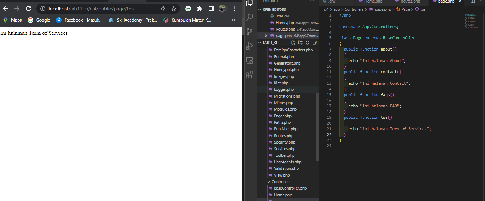

Membuat View Selanjutnya adalam membuat view untuk tampilan web agar lebih menarik. Buat file baru dengan nama about.php pada direktori view (app/view/about.php) kemudian isi kodenya seperti berikut.

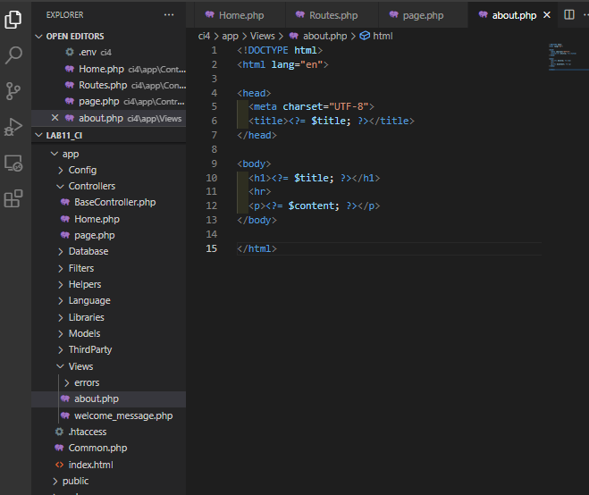

Ubah method about pada class Controller Page menjadi seperti berikut:

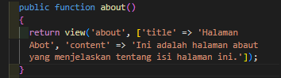

Kemudian lakukan refresh pada halaman tersebut.

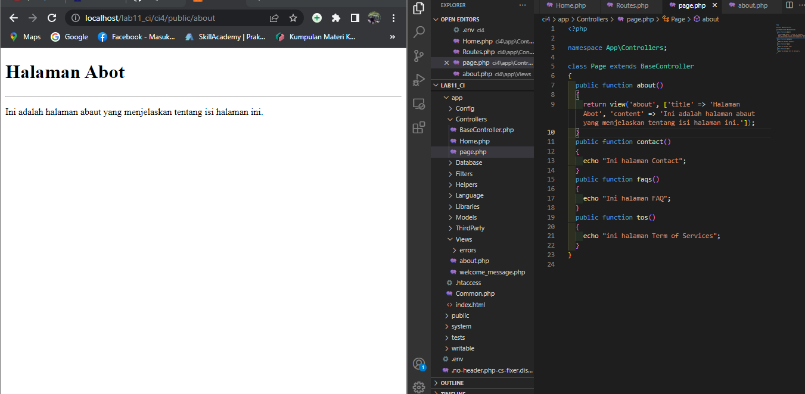

### Membuat Layout Web dengan CSS

Pada dasarnya layout web dengan css dapat diimplamentasikan dengan mudah pada codeigniter. Yang perlu diketahui adalah, pada Codeigniter 4 file yang menyimpan asset css dan javascript terletak pada direktori public. Buat file css pada direktori public dengan nama style.css (copy file dari praktikum lab4_layout. Kita akan gunakan layout yang pernah dibuat pada praktikum 4.

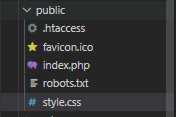

Kemudian buat folder template pada direktori view kemudian buat file header.php dan footer.php File app/view/template/header.php

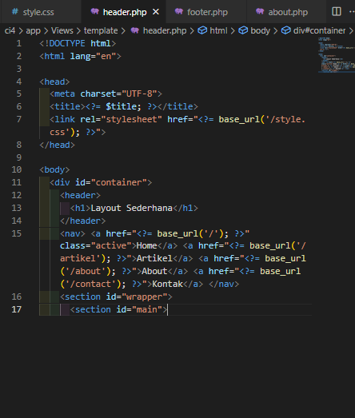

File app/view/template/footer.php

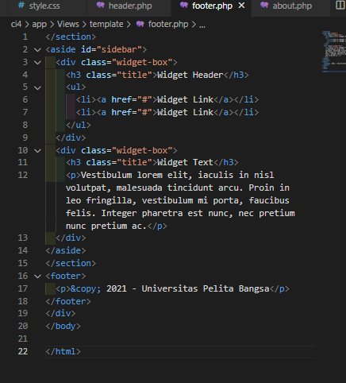

Kemudian ubah file app/view/about.php seperti berikut.

Selanjutnya refresh tampilan pada alamat http://localhost:8080/about

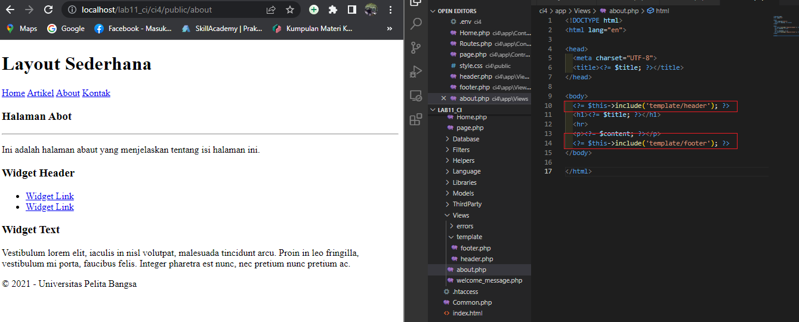

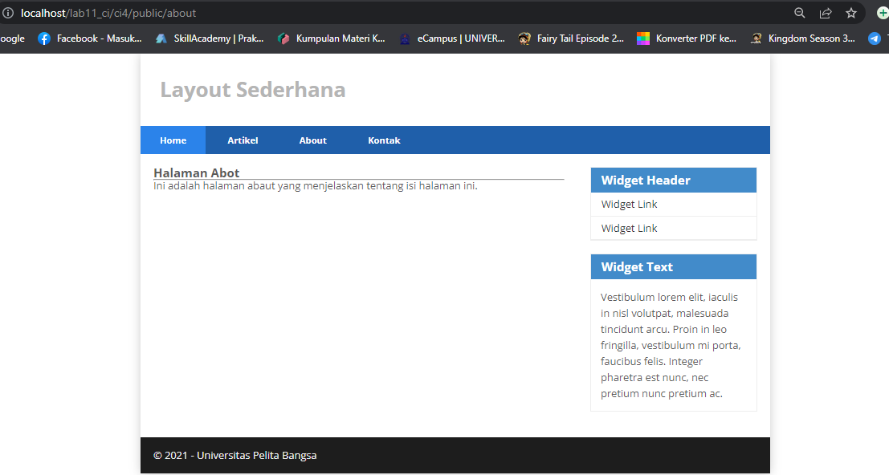

# Pertanyaan dan Tugas

Lengkapi kode program untuk menu lainnya yang ada pada Controller Page, sehingga semua link pada navigasi header dapat menampilkan tampilan dengan layout yang sama.

### Pengaturan Controller

